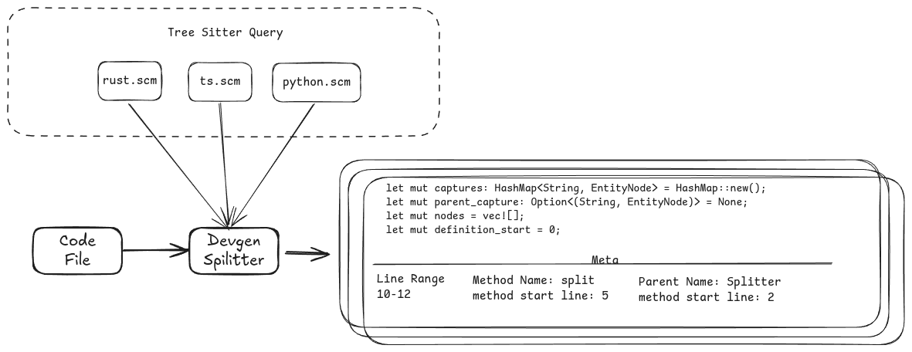

Devgen Splitter is a Rust library that breaks down source code into contextual chunks. 
It utilizes tree-sitter to identify code entities (such as classes, functions, and methods) and generate chunks with contextual metadata.

[](https://crates.io/crates/devgen-splitter)
[](https://codecov.io/github/imotai/devgen-splitter)




## Features

- Language-aware code splitting
- Generate chunks with contextual metadata
- Support for multiple programming languages

why devgen-splitter?

If you are building a code search agent, you may want to the LLM to generate the link for related class, struct, enum, etc. Devgen Splitter can help you generate the chunks with contextual metadata.

## Usage


Add `devgen-splitter` to your project:

```bash
cargo add devgen-splitter
```

Basic usage example:

```rust
use devgen_splitter::{SplitOptions, split};
let code = "fn main() { println!(\"Hello, world!\"); }";
let options = SplitOptions { chunk_line_limit: 10};
let chunks = split("example.rs", code, &options).unwrap();
for chunk in chunks {
    println!("Chunk: {:?}", chunk);
}
```
For more examples, go to [examples](./examples)

## Supported Languages

| Language   | Query Rules | Splitter | Test |
|------------|-------------|----------|------|
| Rust       | ✅          | ✅       | ✅   |
| TypeScript | ✅          | ✅       | ✅   |
| Java       | ✅          | ✅       | ✅   |
| Python     | ✅          | ✅       | ✅   |
| Solidity   | ✅          | ✅       | ✅   |
| Go         | 🚧          | 🚧       | 🚧   |
| C++        | 🚧          | 🚧       | 🚧   |
| C          | 🚧          | 🚧       | 🚧   |

More languages coming soon!

## Language Mapping

The following table shows how different code structures are represented across various programming languages and their corresponding tree-sitter query rule names:

| Type       | Tree-sitter Query | Rust     | Java     | TypeScript | Python   | Go       | C++      |
|------------|-------------------|----------|----------|------------|----------|----------|----------|
| Function   | function.definition | function     | N/A   | function/array function   | function     | function  | function |
| Method   | method.definition | method    | method   | method   | method      | method     | method |
| Struct     | struct.declaration | struct  | class    | interface  | class    | struct   | struct   |
| Class      | class.declaration | impl     | class    | class      | class    | N/A      | class    |
| Interface  | interface.declaration | trait | interface| N/A  | N/A      | N/A| N/A      | N/A      |
| Enum       | enum.declaration  | enum     | enum     | enum       | N/A      | N/A      | enum     |


## Development Status

Devgen Splitter is in active development. We welcome community contributions and feedback.
